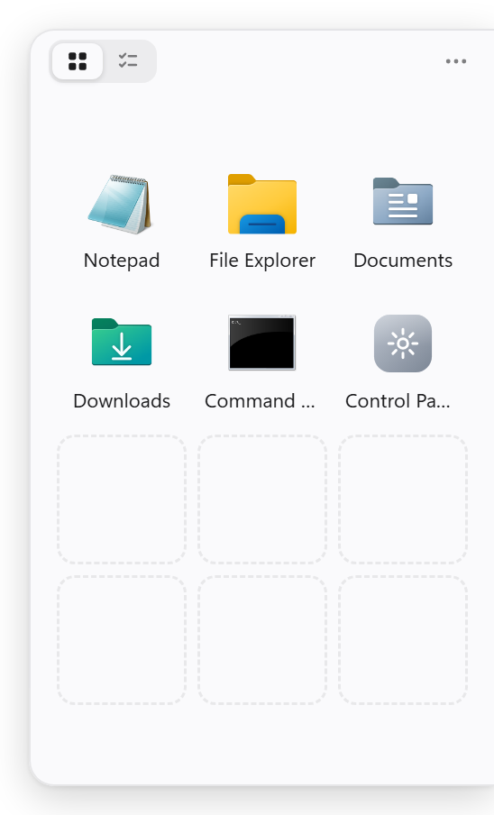
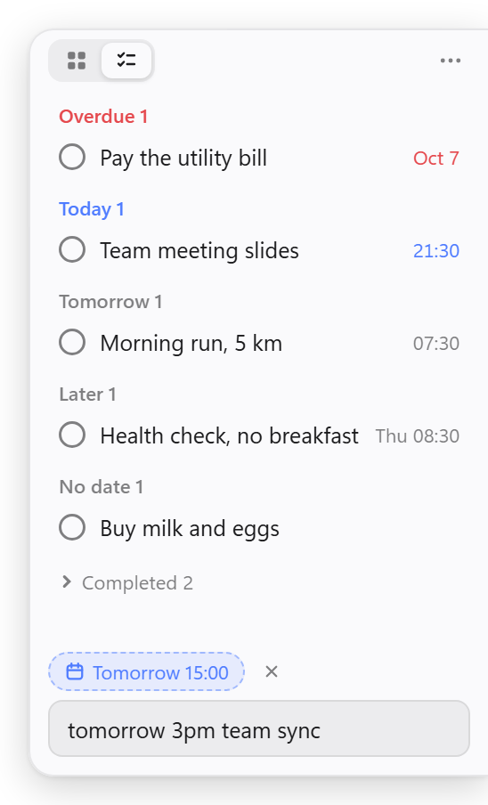
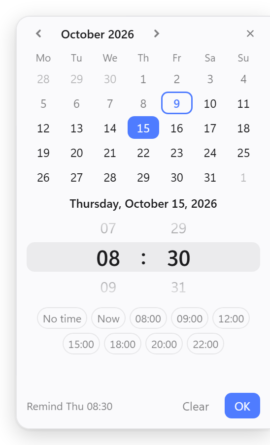
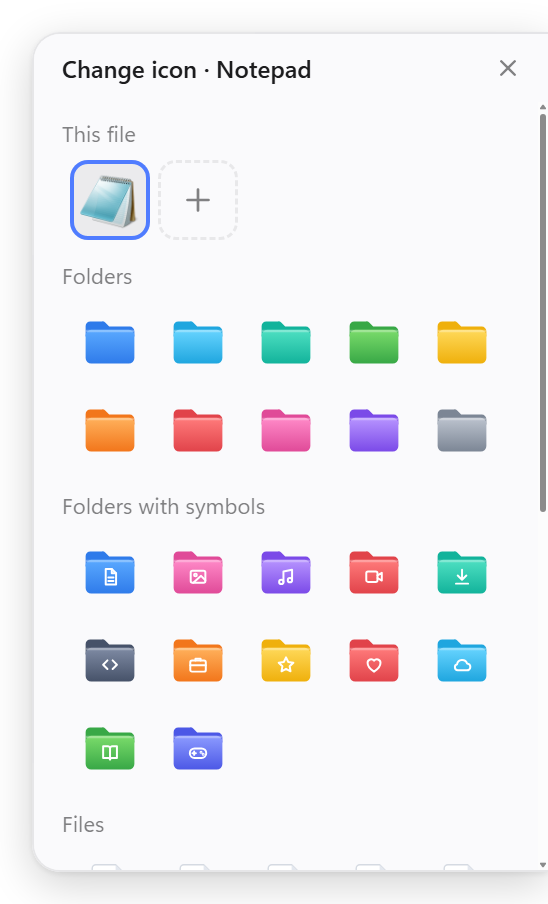

<p align="center">
  
</p>

<h1 align="center">Edgelet</h1>

<p align="center">
  An app launcher for Windows that docks to the screen edge, slides out when you need it, and hides when you don't.
</p>

<p align="center">
  <b>English</b> · <a href="README.zh-CN.md">简体中文</a>
</p>

<p align="center">
  
  
  
</p>

---

Windows 11 removed the taskbar toolbars and Quick Launch, and desktop icons are usually buried under windows. Edgelet keeps your favorite apps, files and folders in a small drawer tucked into the edge of the screen. Touch the edge or press a hotkey and it slides out; launch something and it tucks itself away again.

<p align="center">
  
  &nbsp;
  
  &nbsp;
  
  &nbsp;
  
</p>

## Features

- **Edge docking**: drag the panel anywhere and it snaps to the nearest screen edge; when hidden, only a thin handle remains. Multi-monitor aware.
- **Several ways to open it**: hover the screen edge, press the global hotkey `` Alt+` ``, or click the tray icon
- **Drag and drop**: drop apps, shortcuts, files or folders from Explorer or the desktop onto the panel; drag tiles to reorder
- **Native icons**: shows the same high-resolution (256px) icon Explorer uses, not a content thumbnail
- **Custom names and icons**: rename items inside the panel (the real file is untouched), pick from 50 built-in icons, or use your own image
- **Layout presets**: strip 1×6, compact 2×4, standard 3×4, square 4×4, large 4×6; small / medium / large icons; optional labels. Rows and columns swap automatically on the top and bottom edges.
- **Memos**: a slider at the top switches to a to-do page; type at the bottom and press Enter to add, click to complete; grouped into overdue / today / tomorrow / later / no date
- **Dates and reminders**: dates are recognized as you type, e.g. `tomorrow`, `fri 3pm`, `next tuesday`, `oct 15`, `in 3 days` (Chinese phrases such as 明天 or 周五下午3点 work too); or pick one with quick buttons or a calendar with a time wheel; a system notification pops up when it's due
- **English and Chinese**: the interface follows the system language and can be switched any time under *Language / 语言*
- **Keyboard**: arrow keys to move, `Enter` to open, `F2` to rename, `Esc` to hide
- **Also**: run as administrator, open file location, start with Windows, follows the system light / dark theme

## Download

Get the latest version from [Releases](https://github.com/luylin5/Edgelet/releases/latest):

- **`Edgelet-Setup-x.y.z.exe`**: installer; creates desktop and Start menu shortcuts and can be uninstalled from *Settings → Apps*
- **`Edgelet-x.y.z-portable.exe`**: portable; just double-click, no installation

> The app is not code-signed, so Windows SmartScreen may show "Windows protected your PC" on first launch. Click **More info → Run anyway**.

## Run from source

Requires [Node.js](https://nodejs.org/) 18 or later. Windows only.

```bash
git clone https://github.com/luylin5/Edgelet.git
cd Edgelet
npm install
npm start
```

### Create desktop shortcuts

```bash
npm run launcher
```

Puts an "Edgelet" shortcut in the project folder, on the desktop and in the Start menu. It launches the app without a console window. Run it again if you move the project folder.

## Usage

| Action | How |
| --- | --- |
| Add items | Drop files onto the panel, or `⋯` → *Add file or app…* / *Add folder…* |
| Move | Drag the title bar; it snaps to the nearest edge on release |
| Show / hide | Hover the edge handle · `` Alt+` `` · tray icon · `Esc` |
| Rename | Right-click a tile → *Rename*, or select it and press `F2` |
| Change icon | Right-click a tile → *Change icon…* |
| Reset | Right-click a tile → *Restore default name and icon* |
| Layout / icon size / labels | Right-click an empty area of the panel, or use the tray menu |
| Keep it visible | Uncheck *Auto-hide* |
| Switch to memos | Click the checklist icon on the right of the top slider |
| Add a memo | Type in the bottom box and press `Enter`; phrases like `tomorrow` or `fri 3pm` set the date automatically |
| Complete / restore | Click a memo; completed ones are collected at the bottom |
| Set a date | Quick buttons or the calendar icon above the input, or right-click a memo → *Date*; double-click the time wheel to type a time |
| Edit / delete | Right-click a memo, or select it and press `F2` / `Delete` |
| Turn off reminders | Right-click an empty area of the memo page and uncheck *Reminders* |
| Language | Right-click an empty area of the panel, or the tray icon → *Language / 语言* |

## Configuration

Settings are stored in `%APPDATA%\edgelet\config.json`:

| Key | Description | Default |
| --- | --- | --- |
| `hotkey` | Global hotkey in [Electron accelerator format](https://www.electronjs.org/docs/latest/api/accelerator), e.g. `Ctrl+Alt+Space` | `` Alt+` `` |
| `layout` | `strip` / `compact` / `standard` / `square` / `large` | `standard` |
| `iconSize` | `small` / `medium` / `large` | `medium` |
| `showLabels` | Show item names | `true` |
| `autoHide` | Hide automatically | `true` |
| `remind` | Memo reminders (date-only memos are reminded at 09:00 that day) | `true` |
| `lang` | Interface language: `auto` (follow the system) / `en` / `zh` | `auto` |

Restart the app after changing `hotkey`. Everything else can be switched from the menus.

## Project structure

```
main.js                 Main process: window, edge snapping, hover detection, hotkey, tray, config
preload.js              Bridge between the main process and the UI
renderer/               Panel UI (HTML / CSS / JS)
  i18n.js               Interface text in English and Chinese
  presets.js            Built-in icon library (generated SVG)
  dates.js              Memo date recognition and formatting
helpers/file-icons.ps1  Reads 256px system icons
assets/                 App icon sources (SVG) and generated .ico / .png
scripts/
  build-icon.js         Builds icon.ico from the SVGs (npm run icon)
  make-launcher.js      Creates shortcuts (npm run launcher)
```

### Build

```bash
npm run dist
```

Produces the installer and the portable exe in `dist/`.

## License

[MIT](LICENSE)
