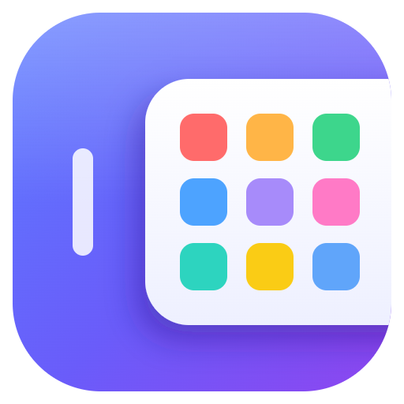
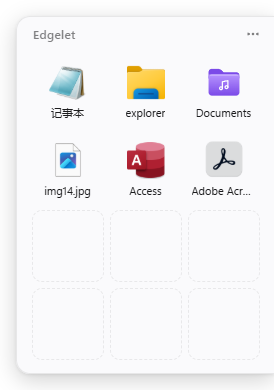
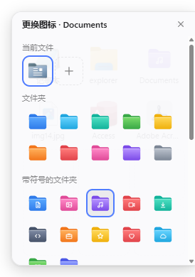
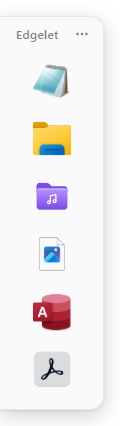

<p align="center">
  
</p>

<h1 align="center">Edgelet</h1>

<p align="center">
  贴在屏幕边缘、用时滑出、不用时自动隐藏的 Windows 快捷启动面板
</p>

<p align="center">
  <a href="README.md">English</a> · <b>简体中文</b>
</p>

<p align="center">
  
  
  
</p>

---

Windows 11 去掉了任务栏「工具栏 / 快速启动」，桌面图标又经常被窗口挡住。Edgelet 把常用的软件、文件和文件夹收进一个小抽屉，藏在屏幕边缘：鼠标碰到边缘或者按下快捷键，它就滑出来；点开一个程序，它又自己收回去。

<p align="center">
  
  &nbsp;&nbsp;
  
  &nbsp;&nbsp;
  
</p>

## 功能

- **贴边隐藏**：拖动到任意位置，松手后自动吸附到最近的屏幕边缘，收起后只留一条细把手；支持多显示器
- **多种呼出方式**：鼠标移到边缘、全局快捷键 `` Alt+` ``，或单击托盘图标
- **拖进来就能用**：从资源管理器或桌面把软件、快捷方式、文件、文件夹拖进面板即可添加，拖动图标调整顺序
- **原生图标**：显示文件在资源管理器里的高清系统图标（256px），不是内容预览
- **自定义名称和图标**：在面板里重命名（不改动真实文件），从 50 个预制图标中挑选，或者用自己的图片
- **预制布局**：竖条 1×6、紧凑 2×4、标准 3×4、方阵 4×4、大面板 4×6；图标大小可选小 / 中 / 大，名称可隐藏；贴上下边时自动横向排列
- **键盘操作**：方向键选择、`Enter` 打开、`F2` 重命名、`Esc` 收起
- **其他**：以管理员身份运行、打开文件所在位置、开机启动、跟随系统深色 / 浅色模式

## 下载

到 [Releases](https://github.com/luylin5/Edgelet/releases/latest) 下载最新版本：

- **`Edgelet-Setup-x.y.z.exe`**：安装版，会创建桌面和开始菜单快捷方式，可在「设置 → 应用」里卸载
- **`Edgelet-x.y.z-portable.exe`**：便携版，双击即用，不需要安装

> 程序没有代码签名，首次运行时 Windows SmartScreen 可能提示「Windows 已保护你的电脑」，点「更多信息 → 仍要运行」即可。

## 从源码运行

需要 [Node.js](https://nodejs.org/) 18 或更高版本，仅支持 Windows。

```bash
git clone https://github.com/luylin5/Edgelet.git
cd Edgelet
npm install
npm start
```

### 创建桌面快捷方式

```bash
npm run launcher
```

会在项目目录、桌面和开始菜单各放一个「Edgelet」快捷方式，双击启动，不弹命令行窗口。移动项目文件夹后需要重新运行一次。

## 使用

| 操作 | 方法 |
| --- | --- |
| 添加 | 拖入文件，或右上角 `⋯` →「添加文件或软件…」/「添加文件夹…」 |
| 移动位置 | 按住标题栏拖动，松手自动贴边 |
| 呼出 / 收起 | 鼠标移到边缘把手 · `` Alt+` `` · 托盘图标 · `Esc` |
| 重命名 | 右键图标 →「重命名」，或选中后按 `F2` |
| 更换图标 | 右键图标 →「更换图标…」 |
| 恢复默认 | 右键图标 →「恢复默认名称和图标」 |
| 布局 / 图标大小 / 显示名称 | 右键面板空白处，或托盘菜单 |
| 固定显示 | 取消勾选「自动隐藏」 |

## 配置

配置保存在 `%APPDATA%\edgelet\config.json`：

| 字段 | 说明 | 默认值 |
| --- | --- | --- |
| `hotkey` | 全局快捷键，[Electron 加速键格式](https://www.electronjs.org/docs/latest/api/accelerator)，如 `Ctrl+Alt+Space` | `` Alt+` `` |
| `layout` | `strip` / `compact` / `standard` / `square` / `large` | `standard` |
| `iconSize` | `small` / `medium` / `large` | `medium` |
| `showLabels` | 是否显示名称 | `true` |
| `autoHide` | 是否自动隐藏 | `true` |

修改 `hotkey` 后需要重启程序，其余选项都可以直接在菜单里切换。

## 项目结构

```
main.js                 主进程：窗口、贴边吸附、悬停检测、快捷键、托盘、配置
preload.js              主进程与界面之间的接口
renderer/               面板界面（HTML / CSS / JS）
  presets.js            预制图标库（SVG 生成）
helpers/file-icons.ps1  读取 256px 系统图标
assets/                 程序图标源文件（SVG）和生成的 .ico / .png
scripts/
  build-icon.js         由 SVG 生成 icon.ico（npm run icon）
  make-launcher.js      创建快捷方式（npm run launcher）
```

### 打包

```bash
npm run dist
```

在 `dist/` 里生成安装版和便携版 exe。

## 许可证

[MIT](LICENSE)
